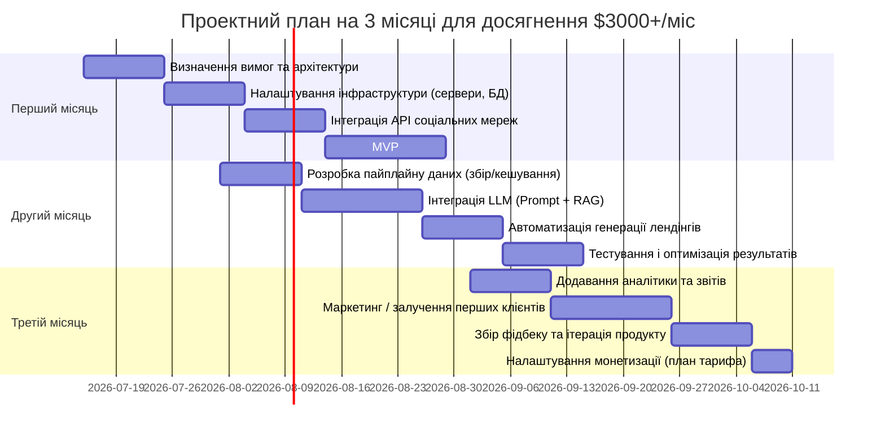

# Виконавчевий підсумок

Проєкт для генерації лідів і автоматичного створення лендінг-сторінок може ефективно використовувати сучасні великі мовні моделі (LLM) та відповідні конектори до соціальних і картографічних сервісів. Для генерації **текстового контенту** (маркетингові тексти, описи, лендинги) найкраще підходять потужні трансформери: комерційні моделі OpenAI (GPT-4/GPT-5), Anthropic Claude, Google Gemini/Imagen (PaLM), а також Open-Source LLM (DeepSeek, LLaMA, Mistral). Для **генерації коду** – спеціалізовані моделі з кодовим ядром (наприклад, GPT-4o/Codex, Meta CodeLlama, OpenAI GPT-Code, Cohere Code LLM, MiniMax, Kimi/K2.5). Для **мультимедіа (зображення, соцпости, OG-банери)** – моделі-генератори зображень: DALL·E 3 (OpenAI), Imagen 4 (Google), Flux 2 Pro / Ideogram v3 / Stable Diffusion тощо.  

Ключові конектори: офіційні API для Instagram і Facebook (Graph API), Google Maps API (Places/Geocoding) та Google Business Profile API для отримання даних про компанії. Також можливі скрапери (Instaloader, Apify) або агреговані сервіси (Netrows, n8n тощо) для соціальних мереж. Для медіа-генерації – API OpenAI (DALL·E), StabilityAI (DreamStudio), Google Cloud AI (Imagen) тощо.  

Архітектура система включає **пайплайн**: збір і збагачення даних (інтегратори соціальних медіа та карт), генерація контенту через LLM, побудова лендингу, розгортання й аналітика. Рекомендуються мікросервіси (FastAPI/Node.js), черга завдань (RabbitMQ/Kafka), реляційна БД + векторна база (Postgres+Pinecone/Weaviate), сховище об’єктів (S3), кеш (Redis). Сек’юрність: JWT/RBAC для ролей (admin/operator), шифрування PII, обмеження rate limits, безпечне зберігання ключів (Vault).  

Далі наведено детальні рекомендації з вибору моделей/конекторів (з таблицями), архітектурні патерни (з діаграмами mermaid), шаблони промптів і план дій (3-місячний roadmap).

## Рекомендовані LLM для контенту, коду та мультимедіа

### Генерація текстового контенту

- **OpenAI GPT-5.x** (або GPT-4o): найпотужніші комерційні моделі для креативного та технічного письма. Ідеальні для маркетингових текстів, складних лендингів, SEO-запитів. Підтримують функціональний виклик (Function Calling), потік (streaming), доопрацювання (fine-tuning) та векторне вбудовування (embeddings). Ціни: від ≈$1–5 на 1K вхідних токенів, $5–25 на 1K вихідних. Мінуси: вартість зростає з обсягом (токеномісткість) та залежність від зовнішнього API.  
- **Anthropic Claude** (Opus/Sonnet/Haiku). Claude Opus 4.8 за якістю близький до GPT-4, коштує ~$5 вхід/$25 вихід (на мільйон токенів). Sonnet-4.6 – дешевший ($3/$15) і підійде для більшості задач контенту, Haiku 4.5 – дуже економний ($1/$5) для простих текстів. Claude особливо гарно підходить для виважених відповідей і має функцію передачі тональності.  
- **Google Gemini (Gemma)** / **Imagen 4**: передові мультимодальні моделі Google. Imagen 4 Ultra генерує фотореалістичні зображення ($0.02–$0.06 за картинку), але Google Gemini/Imagen також підтримує текстові LLM-інтерфейси для копірайтингу (Gemini) та багатомодальні функції. Платформа Vertex AI надає їх як API. Вартість: плата за API+ місячні підписки (AI Plus/Pro включають 100–1000 зображень/день та екземпляри чат-ЛЛМ).  
- **DeepSeek-V4-Pro / Mimo-V2.5-Pro**: великі відкриті моделі (1.6T параметрів) з контекстом до 1M токенів. Хороші для генерації довгих текстів, розуміння складного доменно-специфічного контенту. Підходять для RAG (довгий контекст, багато вставок). Перевага – можлива власна хостинг/інференс без відправки даних зовні. Витрати – GPU-інференс (потрібен потужний сервер, ~тривалість відповіді ~секунди на запит).  
- **LLaMA 3/4 (Meta)**: відкритий мультиплатформений LLM з підтримкою тексту та зображень (Ллама-4 до 10M токенів контексту). Безкоштовний (за ліцензією), але потребує власної інфраструктури і GPU. Підходить для комунікацій і RAG із внутрішніми даними.  
- **Інші open-source**: Mistral (більше промпт-орієнтований), Mixtral, Cohere Command, PEGASUS (абревіатура Google) тощо. Good balance price/quality для контентних задач, але не настільки сильні як вищезазначені. Можуть бути використані для економії вартості або локального хостингу (зниження ризику передачі даних).

| Модель           | Провайдер      | Ціна (на 1K токенів)            | Основне використання     | Особливості                        |
|------------------|----------------|---------------------------------|--------------------------|-------------------------------------|
| **GPT-5.6 Luna** | OpenAI         | ~ $0.10 (in) / $0.60 (out) | Копірайтинг, лендинги   | Функціональний виклик, streaming, fine-tune, embeddings |
| **GPT-5.6 Sol**  | OpenAI         | ~ $2.50/$15 (мін) | Складні тексти, аналітика | Швидкий, великий контекст (54K–128K токенів)         |
| **Claude Opus 4.8** | Anthropic    | $5/$25          | Розгорнуті відповіді     | Стриманий стиль, без fine-tune       |
| **Claude Sonnet 4.6** | Anthropic  | $3/$15          | FAQ, підтримка          | Бюджетніший, відповідає добре на докладні запити      |
| **Claude Haiku 4.5** | Anthropic   | $1/$5              | Швидкий контент         | Економний; прим.: чат-боти, довідка      |
| **Gemma 4 (Google)** | Google      | ~ від $0.02/зображ. (Iconic) | Маркетингові описи      | Mультимодальний, багатомовний; API через Google Cloud |
| **DeepSeek V4-Pro** | DeepSeek AI  | відкритий (без ліцензії)       | SEO-контент, довгі тексти | Mixture-of-Experts, контекст 1M токенів |
| **LLaMA 4**      | Meta AI        | відкритий (лицензія Meta)      | Контент/Допомога        | Зображення+текст, 10M токенів контекст |
| **Mistral Large** | Mistral AI     | безкоштовний (open-source)     | Контент, код           | Ефективний на GPU; безкоштовний         |

### Генерація коду

- **OpenAI GPT-4o / Codex**: сильний у коді (React, Node, Python, SQL). Підтримує високу швидкість генерування коду, виправлення помилок та інтеграцію документації. API підтримує автодоповнення і fine-tuning. Ціна (як у загальному GPT-4).  
- **Meta CodeLlama**: варіант LLaMA, натренований на коді. Безкоштовний, але за комплексні задачі може поступатися GPT. Має декілька версій (включно до 70B) для балансування швидкості та точності.  
- **Cohere Command Code** (наприклад, Cohere Code LLM): модель, оптимізована для кодування (підсвічування, пояснення коду). Pay-as-you-go на запитах.  
- **MiMo V2.5 Pro** (Xiaomi) / **Kimi K2.5**: потужні мультимодальні MoE-моделі з підтримкою коду. Підійдуть для згенерування фронтенду або бекенду за описом. Хоч і open, потребують GPU.  
- **MiniMax M2.5**: відкритий LLM, орієнтований на задачі програмування і автоматизації (RL-based, швидкий вивід). Якщо є у відкритому доступі – дешевший варіант.  
- **Anthropic Claude**: непогано працює з кодом (особливо нові Sonnet/Opus). Наприклад, Claude Opus 4.8 здатен писати та пояснювати код.  
- **API GitHub Copilot** (від OpenAI): як альтернатива, спеціалізована на коді в IDE.

| Модель           | Провайдер      | Ціна                         | Завдання              | Особливості                       |
|------------------|----------------|------------------------------|-----------------------|-----------------------------------|
| **GPT-4o Code**  | OpenAI         | ~ $2.50/$15 за 1M tok | Фронтенд/бекенд, авто-тести | Підтримує функц. виклик, відлагодження |
| **CodeLlama 34B** | Meta AI       | безкоштовно                  | Генерація React/Vue   | Open-source, діалектом Python      |
| **Claude Opus 4.8** | Anthropic    | $5/$25         | Коментування коду     | Більш консистентний, ніж GPT в деяких завданнях |
| **Mistral 8x7B** | Mistral AI     | безкоштовно                  | Прості скрипти        | Компактний, відкритий, швидкий    |
| **MiMo V2.5 Pro**| Xiaomi         | безкоштовно (open-source)    | Бекенд генерація      | 310B MoE, сильний в агентних задачах |
| **Google Gemini Code** | Google    | API платний                 | Розробка та ідеї      | Модель Gemini з фокусом на код, через Google AI |

### Генерація зображень та мультимедіа

- **OpenAI DALL·E 3 / GPT Image**: для створення маркетингових банерів, OG-зображень тощо. Через API (або вбудовано в ChatGPT). Якість: фотореалістика та стильні ілюстрації. Ціна ~ $0.04–$0.08 за зображення 1024×1024. Часто безкоштовно у складі передплати ChatGPT Plus (до 100+ зображень/день).  
- **Google Imagen 4 (Nano Banana)**: API в Google Cloud. Важлива перевага – дуже велика швидкість та точність тексту на зображенні (ідеально для OG-банерів з текстом). Ціна: $0.02–$0.06/зображ, набагато дешевше GPT-DALL·E. Потрібна реєстрація Google Cloud та налаштування billing.  
- **Flux 2 Pro (Atlas Cloud)**: фотогенна модель (через Atlas Cloud API). Вартість ~$0.03–0.06 за зображення (за їх даними).  
- **Ideogram v3**: орієнтована на тексти (логотипи, шрифти на картинках). Може бути інтегрована через сервіс Ideogram.ai API (умовно безкоштовно з хмарними кредитами).  
- **Stable Diffusion 2.1/XL (StabilityAI)**: open-source, багато імплементацій. Можна використовувати через безкоштовні API (HuggingFace, StabilityAI DreamStudio) або локально на GPU. Якісні для арт/рекламних ілюстрацій. Частіше використовують для генерації ідей чи стилізації; офіційний сайт пропонує $10 безкоштовного кредиту і далі ~ $0.01–0.02 за картинку.  
- **Midjourney**: висока художня якість, але **немає офіційного API** (тільки Discord-бот). Для автоматизації менш підходить (скрейпінг Discord порушує правила). Більш доречно для дизайнерського процесу вручну.  

Для порівняння: відкриті моделі (Stable Diffusion, Ideogram) майже безкоштовні, але потребують налаштувань. Комерційні (DALL·E, Imagen) простіші в інтеграції і мають підтримку, але дорожчі та потребують API-ключа.

| API / Модель     | Провайдер       | Ціна (за зображення)          | Користь               | Особливості                  |
|------------------|-----------------|-------------------------------|-----------------------|------------------------------|
| **DALL·E 3**     | OpenAI          | ~$0.04–$0.08     | OG-зображення, банери | Інтегрується в ChatGPT/API    |
| **GPT Image 1.5** | OpenAI         | ~$0.011–$0.167   | Швидке тестування     | Великий вибір стилів         |
| **Imagen 4 Ultra** | Google        | $0.06 (High Quality) | Фотореалізм, тексти  | Висока швидкість, чіткі тексти |
| **Stable Diffusion** | StabilityAI  | ~$0.01–$0.02 через API (DreamStudio) | Художні ідеї          | Безкоштовні моделі, сильна кастомізація |
| **Flux 2 Pro**    | Atlas Cloud    | ~$0.03–0.06    | Рекламні фото         | Висока фотокач-ть (через Atlas API) |
| **Ideogram v3**   | Ideogram.ai    | безкоштовно/кредити           | Текст у зображенні    | Відкритий API, текст-в-образ |

## Конектори та API даних

### Instagram

- **Instagram Graph API**: офіційний API для бізнес-акаунтів (Meta). **Безкоштовний** (потрібен Facebook Developer акаунт, додаток, OAuth-токен). Дозволяє отримувати дані про власні бізнес-сторінки (пости, коментарі, аналітику). Обмеження: лише для власних бізнес/creator аккаунтів, складна модель дозволів і App Review (треба чекати затвердження), немає доступу до фоловерів сторонніх профілів.  
- **Інстаграм-скрепери (Instaloader, Apify Instagram actors)**: open-source або сторонні сервіси. **Instaloader** (без API) – просто скачування публічних постів і сторіс, але часто ламається при змінах сайта і потребує вашого логіну (ризик блокування). Підходить тільки для прототипів. **Apify** – хмарні «актори» (ціновий пакет від ~$49/міс), добрі для пакетного збору, але немає гарантій (actor-maintainer може припинити оновлення).  
- **Агрегатори (Netrows, n8n тощо)**: якщо потрібні дані з Instagram разом з LinkedIn, YouTube тощо, то варто розглянути спеціалізовані платформи (наприклад Netrows Integrator). Вони надають єдиний API та уніфіковані тарифні плани. Для готового продукту краще довіряти офіційному API Instagram для власного контенту та використовувати скрепери лише як резерв.

### Facebook

- **Facebook Graph API (Pages API)**: офіційний REST API. Вимагає додаток, OAuth. Дозволяє працювати з публічними даними сторінок, отримувати пости, відгуки, коментарі. **Безкоштовний** у базовому використанні, але діє ліміт ~200 запитів на 1 годину на кожного користувача для загального доступу. Для великих об’ємів можна запитати підвищення ліміту чи використовувати токени з рівнем маркетингу.  
- **FB Business API (Marketing API)**: якщо потрібно працювати з бізнес-сторінками (контент, статистика, оголошення), існують окремі ендпоїнти Business API. Вони також мають безкоштовний старт, але суворіші ліміти (див. документацію Meta).  

### Google Maps / Places / Geocoding

- **Google Places API / Geocoding API (Maps Platform)**: офіційні API для пошуку місць за назвою/адресою і отримання інформації (адреса, контакт, рейтинги, відгуки). **Платні (pay-as-you-go)**, але перші 28 000 запитів на місяць безкоштовні (рамковий $200 USD кредит щомісяця до 2025 року). Після цього – ~ $5 за 1000 Geocoding-запитів, $17 за 1000 Place Search тощо (точні тарифи див. Google Docs). Ліміт за замовчуванням – 25 запитів/сек (можна підвищити в консолі). Потрібен API-ключ з включеним білінгом. Увага: Google блокує підозрілі запити (CAPTCHA), тож при великій потребі може знадобитися роутинг через Cloud або декілька API-ключів.  
- **Альтернатива – Google Business Profile API**: для отримання даних конкретних бізнесів (локації, години роботи, послуги, відгуки). Також потребує OAuth і активації Business Profile. Ліміти: **300 запитів на хвилину (QPM)** для типових операцій. Використовується, якщо ціль – зібрати детальний профіль компанії.  
- **Скрапінг/Інші сервіси**: існують комерційні сервіси (SerpApi Google Places, ScrapingBee тощо), але Google суворо карає за несанкціонований скрепінг. Рекомендується обходитися офіційним API.

### Зображення та медіа

- **OpenAI DALL·E API**: доступна через OpenAI API (функція "images"). Потрібен ключ і платіжний аккаунт OpenAI. Ліміт – зазвичай десятки запитів на хвилину (регулюється OpenAI). Коштує від $0.04 до $0.08 за картинку 1024×1024.  
- **StabilityAI DreamStudio**: API доступний через платформу Stability. Потрібно реєструвати обліковий запис StabilityAI та отримати токен. Є безкоштовний стартовий кредит (~$10), далі – ~ $0.01–$0.02 за зображення (визначається тарифом по токенах Stable Diffusion). Ліміти: зазвичай до 10 запитів/сек (залежить від тарифного плану).  
- **Google Imagen API**: через Google Cloud (Vertex AI). Потрібен проект в GCP з API-ключем і підпискою. Нові тарифи (post $200 credit) – $0.02–$0.06 за HighQuality-зображення. Ліміт: по API-ключу ~100 QPS.  
- **Midjourney**: не має API. Можливо інтегрувати лише вручну (Discord Bot) або через неофіційні рішення (ризиково). Для нашого продакшену не підходить.  
- **Canva API / Lexica / Shutterstock**: для отримання стокових зображень чи готових шаблонів можна використовувати API сервісів (наприклад, Unsplash API, Pexels API – безкоштовні фотобанки). Але це більше для ідей; фокусу на AI-генерацію тут немає.  

## Архітектурні патерни та технічний стек

**Пайплайн:** 

```mermaid
flowchart TD
    LeadGen[Генерація лідів] --> DataIngest[Збір даних]
    DataIngest --> FB[Facebook API]
    DataIngest --> IG[Instagram API]
    DataIngest --> GM[Google Maps API]
    DataIngest --> GBP[Google Business API]
    DataIngest --> WebScrape[Веб-скрейпінг]
    
    DataEnrich[Обробка та збагачення даних] --> LLMProc[LLM Генерація]
    DataIngest --> DataEnrich
    WebScrape --> DataEnrich
    
    subgraph Генератори
       LLM_Gen[Текст (контент)]
       CodeGen[Код (компоненти)]
       ImageGen[Зображення/OG-пости]
    end
    DataEnrich --> LLM_Gen
    DataEnrich --> CodeGen
    DataEnrich --> ImageGen
    
    LLM_Gen --> LandingPage[Збір шаблонів лендінгу]
    CodeGen --> LandingPage
    ImageGen --> LandingPage
    LandingPage --> Deploy[Розгортання сайту]
    Deploy --> Analytics[Аналітика і реклама]
    
    Analytics --> Reporting[Моніторинг і звіти]
```

- **Data Ingestion:** сервіси/скрипти, які збирають інформацію про бізнес з Instagram, Facebook, Google Maps, Google Business та (за потреби) з сайтів клієнта (WebScrape). Може бути microservice, що викликає API в фоновому режимі. Використовує: Python (requests, asyncio) або Node.js, чергу завдань.  
- **Data Enrichment:** нормалізація і поєднання отриманих даних; аналіз конкурентів (через LLM чи додаткові API); розрахунок ключових слів (SEO), створення FAQ тощо. Може створюватися в групі (batch jobs).  
- **LLM Генерація:** окремі мікросервіси або Функції, що викликають LLM. Наприклад, FastAPI/Python, що відправляє запит до OpenAI/Claude/DeepSeek (через їхню бібліотеку). Використання функціонального виклику (Function Calling) для отримання структурованих результатів (розділи лендінгу тощо).  
- **Зберігання:** 
  - **Реляційна БД** (PostgreSQL/MySQL) – зберігає інформацію про клієнтів, бізнеси, змодельовані лендинги, статуси завдань. 
  - **Векторна БД** (Pinecone, Weaviate, чи pgvector) – для RAG, зберігає embeddings документів (FAQ, відгуки, опис бізнесу). 
  - **Об’єктне сховище** (S3/GCS) – файли лендінгів, медіа (згенеровані зображення), лог-файли, звіти аналітики. 
  - **Redis** – кешування результатів LLM (можна переотримувати в разі повторних запитів), сесії, rate limiter.
- **Черги повідомлень:** RabbitMQ, Kafka або AWS SQS – для асинхронних задач (збір даних, глибока генерація контенту, оновлення моделей).  
- **Моніторинг:** Prometheus+Grafana або Datadog/NewRelic – метрики завантаження API, затримок, помилок. Логи (ELK Stack) – для дебагу AI відповідей.  
- **CI/CD:** GitHub Actions/GitLab CI – деплой нових версій сервісів; Docker-контейнери та оркестрація (Kubernetes або AWS ECS).  
- **Ролі/Авторизація:** RBAC (Operator vs Admin) – наприклад, використати Auth0 або власну JWT-систему. Admin має доступ до конфігурацій; Operator – тільки до бізнес-логіки. Забезпечити HTTPS, обмежити IP, зберігати ключі в Secrets Manager або Vault.  

**Архітектурні рекомендації:** 
- Використовувати **мікросервіси** для незалежного масштабування (наприклад, окремий сервіс LLM, окремий – генератор лендингів).
- Використовувати **open-source інструменти** для RAG (Haystack, LangChain) щоб інтегрувати LLM з власною базою знань. 
- Для запуску лендінгів – можна генерувати статичні HTML/CSS (Gatsby, Next.js) або динамічний редактор (Drupal/WordPress API) – залежно від потреб. 
- **Навчання та оновлення**: періодично оновлювати підхід генерації на основі зворотного зв’язку (використовувати збір фідбеку від клієнтів про якість тексту/зображень).

## Безпека та конфіденційність

- **PII/персональні дані:** якщо збираються контакти клієнтів чи відвідувачів (телефон, email), обов’язково **анонімізувати** або зберігати з шифруванням. Не передавати справжні приватні дані в LLM (використовувати тільки відкриті/бізнес-дані).  
- **Зберігання ключів:** API-ключі та токени мають зберігатися у захищеному сховищі (AWS Secrets Manager, Vault). Не тримати ключі в репозиторії.  
- **Ролефайненс:** усі ендпоінти API повинні мати throttle (rate limits) – як внутрішні (через API Gateway або Kong), так і зовнішні (через код). Також використовувати retry/backoff при зверненні до зовнішніх сервісів (особливо Google API мають суворі ліміти).  
- **Мережеві підключення:** всі сервіси працюють тільки через HTTPS. Використовувати VPC/subnet, щоб вхідний трафік був контрольований.  
- **Контроль доступу:** введення ролей (Admin vs Operator). Обмежувати дозволи до мікросервісів (наприклад, Operator не може змінювати конфігурації ML, тільки запускати генерацію).  
- **Моніторинг безпеки:** логувати всі критичні події (відмови авторизації, перевищення квот, підозрілий трафік) і встановити алерти (наприклад, понаднормовий відсоток помилок 429/500).  
- **Дотримання політик API:** не відправляти чутливі чи нелегальні дані (насильство, діагнози, приватна інформація) до LLM (policies OpenAI/Anthropic рекомендують).

## Шаблони (промпти) для генерації

- **Лендінг пейдж (content):**  
  > *Промпт:* “Ви – маркетинговий копірайтер. Створіть структуруваний текст лендінгу для малого бізнесу «[назва бізнесу]». Уключіть захопливий заголовок, короткий опис послуг, список переваг (булетами), соціальний доказ (відгук клієнта) і заклик до дії (call-to-action). Оптимізуйте під SEO (ключові слова: [X, Y]). Відповідь видайте у форматі розділених секцій: Title, Subtitle, Features, Testimonial, CTA.”  
  *Пояснення:* Дозволяє LLM сфокусуватися на потрібних елементах сторінки та повернути структурований результат.  

- **Код фронтенд-компонента (frontend code):**  
  > *Промпт:* “Напиши код React-компонента **{ComponentName}**, який показує [опис функціоналу]. Компонент має приймати пропси `title` (заголовок сторінки) та `items` (массив об’єктів із заголовком і описом). Використай [бібліотеку UI, наприклад Material-UI або Bootstrap] та зроби верстку у вигляді карток. Коментарі не потрібні.”  
  *Пояснення:* Чітко задає мову (React), пропи та UI-бібліотеку.  

- **Промпт для OG-/соцпост-образу:**  
  > *Промпт:* “Згенеруй стильне квадратне зображення (1024×1024) для обкладинки соцмережі. Тема: *розвиток IT-бізнесу*. Кольори: фірмові #FF6600 і #FFFFFF, текст *«Підніміть свій бізнес на новий рівень»* великими білими літерами по центру, фон – абстрактні технологічні візерунки. Стиль: сучасний, мінімалістичний.”  
  *Пояснення:* Детально описує кольорову гамму, текст, стилістику та розмір, щоб LLM-зображення зрозуміло вимоги і згенерувало потрібний результат.  

- **RAG-запит:**  
  > *Промпт:* “Використовуючи доданий знаннєвий контекст (нижче), відповідай на питання. Якщо відповідь є в документах – сформулюй чітку відповідь. Якщо ні – скажи «Недостатньо даних».  
  > **Контекст:** [сюди вставити витяги з бази знань про компанію/регіон]  
  > **Питання:** {UserQuestion}.”  
  *Пояснення:* Це запит для Retrieval-Augmented Generation. LLM використовує наведені документи як джерело. Шаблон гарантує, що модель звертатиметься лише до наданого контексту, зменшуючи галюцинації.  

## Порівняльні таблиці

**Моделі LLM (ціна/завдання/риси):** 

| Модель        | Провайдер    | Прибл. ціна (за 1K ток) | Кращі завдання      | Особливості та API                                                      |
|---------------|--------------|-------------------------|---------------------|-------------------------------------------------------------------------|
| GPT-5.6 (Sol) | OpenAI       | $2.50 in / $15 out    | Контент, аналітика  | Function Calls, поток, fine-tune, дуже довгий контекст (54K/128K)        |
| Claude Opus 4.8 | Anthropic   | $5 in / $25 out      | Технічні тексти      | Строгий, стабільний, вбудовування, кешування, privacy by default         |
| DeepSeek V4-Pro | DeepSeek AI | відкрито (без токенів)  | Довгі документи, RAG | 1.6T параметрів (MoE), Context 1M токенів, безкоштовний    |
| LLaMA 4       | Meta AI      | відкрито (community)     | Інтеграція текст/зображення | Мультимодальний, 10M контекст, самохостинг                 |
| Gemma 4       | Google       | API платний             | Багатомовний маркетинг | Multimodal, agentic workflows, fine-tuning                             |
| Mistral 8x7B  | Mistral AI   | відкрито                | FAQ, код             | Компактний, швидкий inference, без fine-tune                           |

**Конектори / API (доступ/ліміти/коментарі):** 

| API / Сервіс        | Тип     | Аутентифікація              | Ліміти (QPM/QPS)         | Ціна / Примітки                                               |
|---------------------|---------|-----------------------------|--------------------------|---------------------------------------------------------------|
| Instagram Graph API | REST    | OAuth (token Instagram)     | ~2000 запитів/добу (потрібно перевірити) | Безкоштовно (для бізнес-акаунтів); обмеження (треба огляд) |
| Netrows (Instagram) | REST    | API ключ                    | залежить від тарифу     | Платний (приклад: 0.005€/запит), мультиплатформений (IG, FB) |
| Facebook Graph API  | REST    | OAuth (App token)           | 200 запросів/юзер/година | Безкоштовно (публічні дані); кворум запитів = (#юзерів/день * 200) |
| Google Places API   | REST    | API Key (billing)           | 25 QPS (можна збільшити) | Pay-as-you-go: є $200 на місяць (до 02.2025), далі плата за кожне місцезнаходження |
| Geocoding API       | REST    | API Key                     | 3000 запитів/хвилина | $5 / 1000 запитів (після кредиту $200)       |
| Google Business API | REST    | OAuth (Google Account)      | 300 QPM (Business API) | Безкоштовно; для локацій (складна реєстрація) |
| DALL·E API          | REST    | API Key (OpenAI)            | залежить від обліку    | ~$0.04–$0.08 / зображення; завжди дозвіл MFA           |
| DreamStudio (SD)    | REST    | API Key (StabilityAI)       | ~10 QPS                | Початковий кредит $10; $0.01–$0.02 / зображення                      |
| Imagen API          | REST    | API Key (Google Cloud)      | 100 QPS (можливо)      | ~$0.02–$0.06 / зображення; потребує GCP обліковку     |

## Дорожня карта (3 місяці до $3000/міс)



- **Місяць 1:** закласти базу – зібрати технічні вимоги, налаштувати сервери, черги, почати інтеграцію соціальних API (Instagram, Facebook, Google Maps). Реалізувати швидкий прототип генерації лендингу (наприклад, на фіктивних даних) для перевірки концепції.  
- **Місяць 2:** розгорнути основний пайплайн: збір/чистка даних, побудова RAG (векторної бази) з інформацією про бізнес, інтеграція LLM через API, автоматизована генерація лендингу (шаблонна верстка). Активно тестувати якість (AB-тести текстів/зображень). Виправляти промпти, параметри LLM.  
- **Місяць 3:** фіналізувати продукт: додати аналітику (збір метрик використання), сформувати MVP для перших платних клієнтів, запустити маркетингову кампанію (email, таргетинг FB/Instagram). Створити платіжний обліковий запис (Stripe/PayPal). Збирати фідбек від пілотних користувачів і поліпшувати генерацію.  

> **Наступні кроки:** після випуску MVP сфокусуватися на якості результату (SEO-аналіз лендінгів, оптимізація вставлених ключових слів), масштабуванні (горизонтальне розширення сервісів) та розвитку набора функцій (додати API для агенцій, White Label, партнери). Регулярно оновлювати моделі/промпти за новими даними та трендами.

